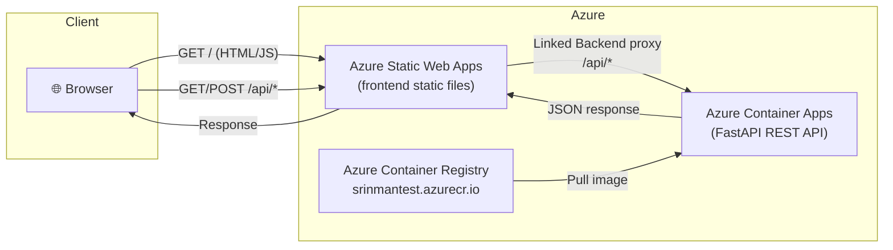

# Items App — Azure Static Web Apps + FastAPI on Container Apps

A simple full-stack demo:
- **Frontend** — static HTML/JS hosted on Azure Static Web Apps (SWA)
- **Backend** — FastAPI REST API running on Azure Container Apps
- **Proxy** — SWA linked backend transparently forwards `/api/*` to Container Apps

## Flow Diagram



## Project Structure

```
├── api/
│   ├── main.py            # FastAPI application
│   ├── requirements.txt
│   └── Dockerfile
├── frontend/
│   ├── index.html
│   └── app.js
├── staticwebapp.config.json   # SWA routing & headers config
└── README.md
```

## API Endpoints

| Method | Path | Description |
|--------|------|-------------|
| GET | `/api/health` | Health check |
| GET | `/api/items` | List all items |
| GET | `/api/items/{id}` | Get item by ID |
| POST | `/api/items` | Create item |
| DELETE | `/api/items/{id}` | Delete item |

---

## Setup & Deployment

### Prerequisites

```bash
# Login to Azure
az login

# Set variables
export SUBSCRIPTION=$(az account show --query id -o tsv)
export TENANT=$(az account show --query tenantId -o tsv)
export RG="rg-items-app"
export LOCATION="eastus"
export ACR_NAME="srinmantest"
export CA_ENV="items-env"
export CA_APP="items-api"
export SWA_NAME="items-swa"
```

### 1 — Create Resource Group

```bash
az group create --name $RG --location $LOCATION
```

### 2 — Build & Push API Image

```bash
az acr build \
  --registry $ACR_NAME \
  --image items-api:latest \
  ./api
```

### 3 — Deploy API to Azure Container Apps

```bash
# Create Container Apps environment
az containerapp env create \
  --name $CA_ENV \
  --resource-group $RG \
  --location $LOCATION

# Create Container App
az containerapp create \
  --name $CA_APP \
  --resource-group $RG \
  --environment $CA_ENV \
  --image ${ACR_NAME}.azurecr.io/items-api:latest \
  --registry-server ${ACR_NAME}.azurecr.io \
  --target-port 8000 \
  --ingress external \
  --min-replicas 1 \
  --max-replicas 3

# Get the Container App URL
export API_URL=$(az containerapp show \
  --name $CA_APP \
  --resource-group $RG \
  --query properties.configuration.ingress.fqdn -o tsv)

echo "API URL: https://$API_URL"
```

### 4 — Deploy Static Web App

```bash
# Create the SWA (free tier)
az staticwebapp create \
  --name $SWA_NAME \
  --resource-group $RG \
  --location $LOCATION \
  --sku Free

# Get SWA deployment token
export SWA_TOKEN=$(az staticwebapp secrets list \
  --name $SWA_NAME \
  --query properties.apiKey -o tsv)

# Deploy frontend files using SWA CLI
npm install -g @azure/static-web-apps-cli

swa deploy ./frontend \
  --deployment-token $SWA_TOKEN \
  --env production
```

### 5 — Link API Backend to SWA (enable proxy)

```bash
# Get the Container App resource ID
export CA_ID=$(az containerapp show \
  --name $CA_APP \
  --resource-group $RG \
  --query id -o tsv)

# Link the backend — SWA will now proxy /api/* to Container Apps
az staticwebapp backends link \
  --name $SWA_NAME \
  --resource-group $RG \
  --backend-resource-id $CA_ID \
  --backend-region $LOCATION

# Verify the link
az staticwebapp backends show \
  --name $SWA_NAME \
  --resource-group $RG
```

### 6 — Get SWA URL

```bash
export SWA_URL=$(az staticwebapp show \
  --name $SWA_NAME \
  --resource-group $RG \
  --query defaultHostname -o tsv)

echo "App URL: https://$SWA_URL"
```

---

## Verify

```bash
# Health check via SWA proxy
curl https://$SWA_URL/api/health

# Create an item
curl -X POST https://$SWA_URL/api/items \
  -H "Content-Type: application/json" \
  -d '{"name":"Widget","description":"A blue widget","price":9.99}'

# List items
curl https://$SWA_URL/api/items
```

---

## Cleanup

```bash
az group delete --name $RG --yes --no-wait
```
